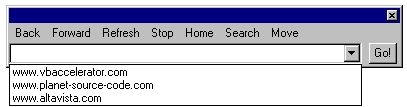



## Giant Browser \- Updated

### Description

This is an update to Jason Theobald's Giant Browser submission (http://www.planet-source-code.com/xq/ASP/txtCodeId.23127/lngWId.1/qx/vb/scripts/ShowCode.htm). I made some changes in the GUI as the screenshot shows, made the toolbox a stay-on-top window, made the browser window a 100% screen filling window, and closing the toolbox closes the browser window. Any changes I made to the code is indicated, but the credit for the original idea/code goes to Jason. Thanks!
 
### More Info
 

             |
---                |---
**Submitted On**   |2001-05-12 18:15:54
**By**             |[Syllva Tech Software](https://github.com/Planet-Source-Code/PSCIndex/blob/master/ByAuthor/syllva-tech-software.md)
**Level**          |Beginner
**User Rating**    |5.0 (10 globes from 2 users)
**Compatibility**  |VB 5\.0, VB 6\.0
**Category**       |[Internet/ HTML](https://github.com/Planet-Source-Code/PSCIndex/blob/master/ByCategory/internet-html__1-34.md)
**World**          |[Visual Basic](https://github.com/Planet-Source-Code/PSCIndex/blob/master/ByWorld/visual-basic.md)
**Archive File**   |[Giant Brow195575122001\.zip](https://github.com/Planet-Source-Code/syllva-tech-software-giant-browser-updated__1-23148/archive/master.zip)

